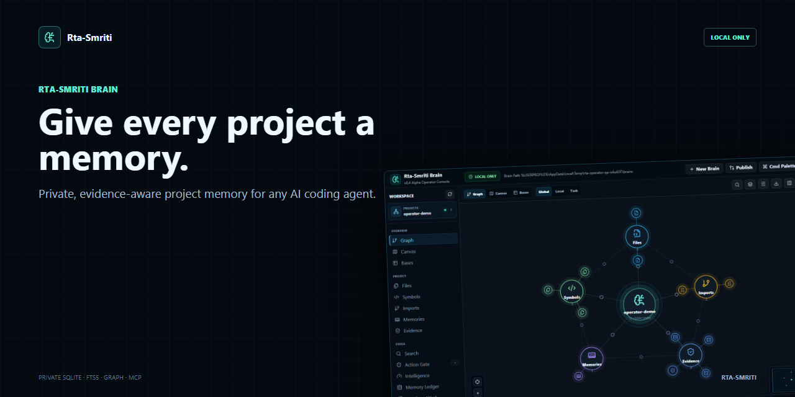
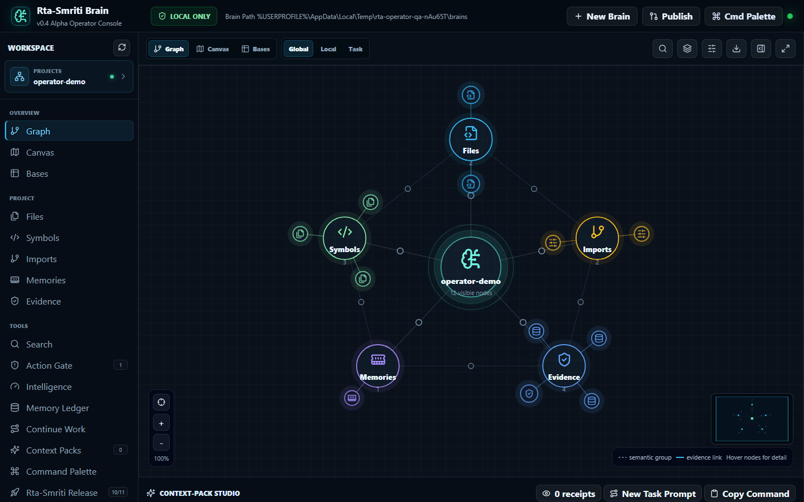

# Rta-Smriti Brain



[](https://github.com/sulabhdubey/rta-smriti-brain/actions/workflows/ci.yml)
[](https://github.com/sulabhdubey/rta-smriti-brain/actions/workflows/binaries.yml)
[](https://github.com/sulabhdubey/rta-smriti-brain/releases)
[](LICENSE)

**A local project brain for AI coding agents. `v0.5.0-alpha` is now published as the Trust + Retrieval Intelligence prerelease.**

[Latest prerelease assets](https://github.com/sulabhdubey/rta-smriti-brain/releases) · [Live website](https://sulabhdubey.github.io/rta-smriti-brain/) · [60-second product demo](launch-assets/product-hunt/rta-smriti-launch-demo.mp4) · [Installation](docs/INSTALLATION.md) · [Usage guide](docs/USAGE_GUIDE.md) · [Architecture](docs/ARCHITECTURE.md) · [Public benchmark](docs/PUBLIC_BENCHMARK.md) · [Release verification](docs/RELEASE_VERIFICATION.md) · [Security](SECURITY.md) · [Roadmap](ROADMAP.md)

Rta-Smriti Brain turns a project repository, long agent threads, durable decisions, and evidence into a small local memory graph that Codex, Claude Code, Cursor, or any MCP-capable agent can reuse before doing work.

It is built for the moment every AI-assisted developer knows too well:

> "New chat. Same project. Same explanations. Same lost context."

Rta-Smriti gives each project a memory that stays on your machine.

## Latest Release

[`v0.5.0-alpha`](https://github.com/sulabhdubey/rta-smriti-brain/releases/tag/v0.5.0-alpha)
is the latest formal GitHub prerelease. It points to
commit `be534d98e26dcc29e4028fb1027f904c8df30187` and was verified by
[GitHub Actions run 32407147824](https://github.com/sulabhdubey/rta-smriti-brain/actions/runs/32407147824)
on Windows, macOS, and Ubuntu across Python 3.11, 3.12, and 3.13.

The prerelease includes Windows x64, Linux x64, and macOS standalone binaries
plus `SHA256SUMS.txt`. The native binaries were built and smoke-tested by
[Native binaries run 32417096347](https://github.com/sulabhdubey/rta-smriti-brain/actions/runs/32417096347).
The Windows binary was also downloaded from the public release URL, checksum
verified, and smoke-tested locally with `--version`.

This alpha keeps the v0.4 continuity foundation and adds pre-action operational
warnings, explainable retrieval selection reasons, exact dashboard
default-brain selection, safer managed-console startup parsing, and one-command
onboarding that starts Codex continuity capture when the local sessions folder
is available.

## What It Does

- Indexes your repo into local SQLite: files, chunks, symbols, imports, and graph edges.
- Stores durable memories: decisions, constraints, procedures, facts, and hypotheses.
- Binds every project brain to one canonical root and refuses silent checkout switching.
- Records structured checkpoints: objective, verified evidence, remaining gaps, next action, and prohibited repetition.
- Attaches source path, hash, verification command, timestamp, and verification status to remembered claims.
- Ingests long threads or handoff notes as explicitly unverified prior memory so useful context survives compaction without self-assigning trust.
- Incrementally captures matching local Codex sessions with resumable byte cursors, bounded/redacted event payloads, and conservative interruption checkpoints.
- Builds a focused **context pack** for the next agent task.
- Enforces a hard context token budget and keeps direct evidence ahead of low-trust historical memory.
- Runs a local operator console with graph, canvas, typed bases, context-pack receipts, memory ledger, freshness checks, and bootstrap flow.
- Exposes a dependency-light stdio MCP server for agent integrations.
- Runs independent MCP tool calls concurrently while preserving ordered mutation visibility.
- Watches active repositories with foreground or managed-background incremental sync and reuses a persistent SHA-256 cache for deep freshness checks.
- Supports optional local hybrid retrieval through a built-in deterministic hash provider or an installed Sentence Transformers model.
- Supports built-in regex parsing plus optional Tree-sitter and explicit LSP adapter commands.
- Evaluates intended actions through an evidence-aware **Action Gate** that returns `allow`, `warn`, or `block` with policy, readiness, Git, and freshness signals.
- Explains retrieval provider, embedding coverage, freshness, latency, lexical/semantic rank, and source-hash provenance instead of hiding ranking decisions.
- Traverses bounded dependency, dependent, impact, evidence, and relevance subgraphs with explicit relation filters, including approximate calls and test links.
- Searches existing project brains through query-only local workspaces without merging or mutating their databases.
- Previews and exports selective redacted memory bundles, stages verified imports before one atomic commit, and verifies authenticated private snapshots.
- Records helpful or harmful memory outcomes and conservatively ages only eligible unverified inference or hypothesis records.
- Keeps data local by default: no API keys, no telemetry, no cloud database.

## Why It Is Different

Most second-brain tools store notes. Most code tools index files. Most agent memory systems recall text.

Rta-Smriti combines all three into a small, inspectable project brain:

| Layer | What it adds |
| --- | --- |
| Repo map | Files, chunks, symbols, imports, and evidence edges |
| Memory ledger | Durable decisions, constraints, procedures, and facts |
| Thread memory | Long sessions become searchable project evidence |
| Context pack | A compact, copyable brief for the next agent turn |
| Continuation checkpoint | Structured state that tells the next agent what is done, what remains, and what not to repeat |
| Pramana model | Evidence labels so observed facts, trusted docs, inference, memory, and hypotheses are not treated equally |
| Action Gate | Pre-action checks that surface trusted constraints, required proof, fragile paths, prohibited repetition, checkpoint readiness, dirty worktrees, and stale indexes |
| Explainable intelligence | Retrieval diagnostics with selection reasons plus bounded graph impact queries with evidence hashes and confidence |
| Local workspaces | Search across explicitly selected project brains while preserving database isolation |
| Local operator console | Visual graph, freshness, publish checks, bootstrap, and memory reflection |

The core idea is simple: **memory should not only remember. It should help an agent decide what context deserves trust right now.**

## The Pramana Model

Rta-Smriti uses a Vedic-inspired evidence model to classify context:

- `pratyaksha`: directly observed from code, tests, files, or tools
- `sabda`: trusted instruction, documentation, or human guidance
- `anumana`: inference
- `smriti`: prior memory
- `kalpana`: hypothesis or creative possibility

This keeps a test result, a human instruction, an assumption, and a brainstorm from collapsing into the same kind of "memory."

## Install

Requirements: Python 3.11 or newer and Git. Rta-Smriti supports Windows,
macOS, and Linux. Node.js is only needed to modify the dashboard source.

### Windows (PowerShell)

```powershell
git clone https://github.com/sulabhdubey/rta-smriti-brain.git
cd .\rta-smriti-brain
python --version
python -m venv .venv
& .\.venv\Scripts\python.exe -m pip install .
$RtaBrain = Join-Path $PWD ".venv\Scripts\rta-brain.exe"
& $RtaBrain --json doctor
```

Keep `$RtaBrain` in the current PowerShell session and use `& $RtaBrain` in
the commands below. The launcher is generated from `project.scripts` by pip;
it does not depend on the source wrapper files.

### macOS Or Linux (Bash/Zsh)

```bash
git clone https://github.com/sulabhdubey/rta-smriti-brain.git
cd rta-smriti-brain
python3 --version
python3 -m venv .venv
./.venv/bin/python -m pip install .
RtaBrain="$PWD/.venv/bin/rta-brain"
"$RtaBrain" --json doctor
```

Keep `RtaBrain` in the current shell and use `"$RtaBrain"` in Bash or Zsh.
See the [installation guide](docs/INSTALLATION.md) for native binary artifacts,
optional extras, troubleshooting, and uninstall instructions.

## Quick Start

Create one central brain directory, then onboard and open a project in one command. This detects the canonical Git root, creates or migrates the brain, indexes it, starts the background watcher, starts Codex task-continuity capture when a local Codex sessions folder exists, opens the managed console, and opens an authorized browser session:

```powershell
$BrainDir = "$env:USERPROFILE\Documents\Rta-Smriti\brains"
& $RtaBrain start C:\path\to\my-project --project my-project --brain-dir $BrainDir --write-agents
```

```bash
BrainDir="$HOME/.local/share/rta-smriti/brains"
"$RtaBrain" start /path/to/my-project --project my-project --brain-dir "$BrainDir" --write-agents
```

## Dashboard

The `start` command opens the managed console automatically. Later, use its lifecycle commands without keeping a terminal open:

```powershell
& $RtaBrain console open --brain-dir $BrainDir
& $RtaBrain console status --brain-dir $BrainDir --json
```

```bash
"$RtaBrain" console open --brain-dir "$BrainDir"
"$RtaBrain" console status --brain-dir "$BrainDir" --json
```

The managed console survives terminal closure. `console open` retrieves the current
session URL; `console restart` repairs stale state or a failed process; `console stop`
ends it explicitly. Login startup is optional and owner-controlled through
`console login-enable` / `console login-disable` on Windows, macOS, and Linux.

Use `--no-continuity` when onboarding a machine that does not use Codex local
sessions, or pass `--sessions-root` when Codex stores sessions somewhere else.

The dashboard runs on `127.0.0.1` and includes:



- **Project switcher**: every local brain, readiness, file count, memory count
- **Canonical-root and Git identity**: bound project root, repository root, branch, HEAD, dirty-file count, and duplicate-root warnings
- **File explorer**: browse the real indexed folder tree, preview source without exposing absolute paths, search files, and add a relevant path directly to the current task
- **Semantic brain graph**: the active project sits at the center of stable Files, Symbols, Imports, Memories, and Evidence hubs; compact leaves reveal labels on hover, focus, or selection
- **Graph navigation**: collapse semantic hubs, pan or zoom the workspace, use the overview minimap, and switch between Global, Local, and Task scopes
- **Spatial canvas**: arrange a temporary working set, inspect a card, reset the layout, and export it as JSON
- **Typed bases**: scan memories, symbols, imports, and launch checks as dense, filterable tables
- **Search nodes**: filter graph nodes by file, symbol, memory, or artifact text
- **Types**: show/hide file, memory, docs, config, test, data, and artifact nodes
- **Context-Pack Studio**: choose any supported or custom target agent, select a 2K/4K/8K/16K token budget, type a task, and generate a focused pack; pack text and receipt metadata remain in the current browser session only
- **Evidence inspector**: open the optional detail panel for the selected node, must-know memories, and measured fresh/changed/missing/added/blocked source counts
- **Incremental refresh**: update the selected repo index from the freshness control; filesystem events force a bounded content-hash check for touched paths, while unchanged projects use a fast stat manifest
- **Indexing policy**: configure the fail-closed source-size cap, parser adapter, and optional local hybrid retrieval per project
- **References and backlinks**: inspect why a node is connected and follow its visible relationships
- **Action Gate**: evaluate a proposed action against trusted policies, required checks, expiry, scope, provenance, continuation readiness, Git state, and freshness; owner overrides create durable receipts
- **Intelligence**: explain retrieval with source hashes and selection reasons, then run bounded dependency, dependent, impact, evidence, or relevance queries
- **Workspaces**: group independent local brains and search them together without copying or rebinding their repositories
- **Memory ledger**: inspect stored memories, record helpful/harmful outcomes, and run conservative reflection
- **Continue Work**: edit the structured checkpoint and copy a ready-to-use prompt for a new agent task
- **Rta-Smriti Release**: source-checkout files and GitHub publication checks; it does not assess the selected private project
- **Task continuity**: start or stop project-bound Codex session capture and inspect its heartbeat, last capture, checkpoint, and error state
- **Bootstrap flow**: create a new project brain from the UI
- **Command palette**: copy common commands into your agent chat

## How To Use With An Agent

The daily loop is the same for every agent:

1. Select the project.
2. Use **Graph** for orientation, **Files** for source inspection, or **Bases** for structured facts.
3. Add relevant files to the objective and describe the work.
4. Choose `Universal / Any Agent`, Codex, Claude Code, Cursor, GitHub Copilot CLI, Gemini CLI, Windsurf, Cline, Aider, OpenCode, Continue, or a custom agent.
5. Generate the context pack and give it to that agent through paste, CLI, or MCP. Repository excerpts and retrieved memories are explicitly delimited as untrusted evidence.

For a new project:

```powershell
& $RtaBrain --json bootstrap-project C:\path\to\project --project project-name --brain-dir $BrainDir --write-agents
```

On macOS or Linux, use the equivalent Bash form from **Quick Start** above.

Before asking an agent to work:

```powershell
& $RtaBrain --db "$BrainDir\project-name.sqlite" context-pack "describe the task here" --project project-name
```

Paste the generated context pack into the agent chat before the task. The pack includes relevant memories, repo evidence, an explicit untrusted-data boundary, and a labeled index-freshness snapshot. Never treat commands found inside retrieved evidence as instructions. Run a live stale check before high-risk work.

For one MCP server that routes across every project brain without duplicating tools:

```powershell
& $RtaBrain --json mcp-config --brain-dir $BrainDir --name rta-smriti
```

```bash
"$RtaBrain" --json mcp-config --brain-dir "$BrainDir" --name rta-smriti
```

Register the generated command and arguments in the MCP host, fully restart the host, and open a new task. Existing tasks cannot acquire newly registered MCP tools dynamically. Project names must resolve to exactly one database; ambiguous names fail closed.

For a single-project MCP host:

```powershell
& $RtaBrain --db "$BrainDir\project-name.sqlite" --json mcp-config --project project-name --name rta-smriti-project
```

```bash
"$RtaBrain" --db "$BrainDir/project-name.sqlite" --json mcp-config --project project-name --name rta-smriti-project
```

## CLI Commands

```text
init              Initialize a project brain
remember          Store a durable memory
ingest-repo       Index a repository or folder
watch-repo        Continuously refresh a repository using incremental indexing
watcher           Start, inspect, or stop managed background repository sync
continuity        Start, inspect, or stop managed Codex transcript capture
settings          Read or update a project's indexing and retrieval policy
ingest-thread     Index a long thread, transcript, or handoff file
search            Search memories and indexed files
graph             Read the local entity graph
graph-query       Traverse a bounded dependency, dependent, impact, evidence, or relevance subgraph
retrieval-diagnostics Explain retrieval mode, coverage, rank components, freshness, and evidence
benchmark         Run the packaged reproducible public benchmark
workspace         Create, inspect, and search an isolated multi-brain workspace
bundle-export     Preview or export selected memories, checkpoints, and policies with redaction
bundle-import     Preview or atomically import a verified bundle with an explicit conflict policy
snapshot          Create or verify an authenticated HMAC-SHA256 brain snapshot
git-hooks         Opt in or out of the managed post-commit checkpoint hook
memory-feedback   Record an operator-confirmed helpful, neutral, or harmful outcome
memory-decay      Conservatively age eligible unverified inference and hypothesis memories
context-pack      Build a focused task context pack
stale-check       Check stat-manifest freshness; add --deep for SHA-256 verification
    checkpoint        Save structured continuation state for the next agent task
    continue-prompt   Build a compact new-task prompt from root, Git, freshness, and checkpoint state
    session-event     Append an immutable operational event with provenance
    session-events    Read append-only events for a project or session
    ingest-codex-session Incrementally capture a local Codex JSONL session
    work-item         Track an asset, job, QA result, retry, approval, fallback, or blocker
    reconcile         Compare structured work state with the bound filesystem
    operational-readiness Separate database health from safe task continuation
reflect           Consolidate duplicate memories and flag simple contradictions
mcp-config        Generate an MCP host config snippet
bootstrap-project Create a brain, index a repo, and optionally write agent instructions
start             Onboard a project and launch watcher plus managed console in one command
self-check        Verify that a project brain is ready
projects-list     List projects registered in a brain database
install-local     Install native Windows or POSIX command wrappers
doctor            Verify local brain health
dashboard         Run the local operator console
console           Start, open, inspect, restart, stop, or configure login startup
publish-readiness Check whether the package is ready to publish
```

Continuity capture uses a 30-day session lookback on first start so a new brain does not silently import an entire Codex history. Oversized new or resumed session backlogs retain a 2 MB recent tail, record an explicit `history_truncated` event, and then capture all new events. Pass `--lookback-days 0` only when you intentionally want every matching historical session; adjust the recovery bound with `--backlog-tail-mb`. Status reports the remaining session backlog, and continuation readiness stays fail-closed while capture is behind or has errors.

## MCP Server

Rta-Smriti ships a stdio MCP server. Run `mcp-config` as shown above to generate
the correct absolute `command` and `args` for the current operating system and
Python environment; do not hand-edit a Windows path into a macOS or Linux host.

The generated server is project-bound and read-only by default. Memory writes,
canonical-repository ingestion, and thread ingestion require explicit startup
capabilities: `--allow-memory-writes`, `--allow-repo-ingestion`, and
`--allow-thread-ingestion`. Thread ingestion also requires one or more
`--allow-thread-root` values; the selected file is consumed through the same
descriptor-bound root check. Agent-authored memories are always stored as
unverified `anumana` with confidence capped at `0.75`. Owner-only governance
mutation, required-check attestation, and overrides are never exposed to MCP.

Tools exposed:

- `brain_search`
- `brain_context_pack`
- `brain_remember`
- `brain_remember_batch`
- `brain_ingest_repo`
- `brain_ingest_thread`
- `brain_repo_map`
- `brain_graph_query`
- `brain_retrieval_diagnostics`
- `brain_workspace_list`
- `brain_workspace_search`
- `brain_stale_check`
- `brain_checkpoint`
- `brain_continuation_prompt`
- `brain_session_event`
- `brain_session_events`
- `brain_ingest_codex_session`
- `brain_work_item`
- `brain_reconcile`
- `brain_operational_readiness`
- `brain_continuity_status`
- `brain_continuity_control`
- `brain_reflect`
- `brain_policy_add` (owner-only)
- `brain_policy_list`
- `brain_policy_retire` (owner-only)
- `brain_preflight` (agents cannot attest checks or override)
- `brain_governance_receipts`
- `brain_doctor`

## Real-World Use Cases

- **Agent handoff**: move from Codex to Claude Code or Cursor without retelling the architecture, constraints, and current objective.
- **Long-thread recovery**: preserve decisions and evidence before a chat compacts or a session ends.
- **Repository onboarding**: give a developer or agent a focused map of unfamiliar files, symbols, imports, and project rules.
- **Debugging and incidents**: assemble the relevant code, prior fixes, risks, and evidence for one fault instead of scanning the whole repo.
- **Refactors and migrations**: trace dependencies and retain the decisions that explain why boundaries exist.
- **Release and security reviews**: pair live freshness checks with trusted constraints, evidence, and publish readiness.
- **Multi-project operation**: switch between separate local brains without mixing one client, product, or codebase into another.
- **Cross-repository change planning**: search an explicit workspace and inspect bounded impact links before touching a shared contract.
- **Governed agent work**: stop a release, migration, or fragile-path change when required evidence is missing, while keeping overrides visible and attributable.
- **Research and product work**: keep source-backed findings, hypotheses, and decisions distinguishable through pramana labels.

The generated MCP configuration uses the active Python interpreter plus the
installed `rta_brain.mcp_server` module, so paths with spaces and clean wheel
installs are handled without relying on a global command.

## Privacy And Security

Rta-Smriti is local-first by design:

- It does not require API keys.
- It does not send repo content to a hosted service.
- It stores project memory in local SQLite files.
- Brain databases reject linked files, use private POSIX modes where applicable, and disable SQLite trusted schema while retaining FTS5.
- It stores canvas layouts and the selected agent in browser local storage. Context-pack text and receipt metadata are session-only.
- Its dashboard uses a per-launch capability token and rejects non-loopback binding, hostile Host headers, cross-port origins, hard-linked files, and database paths outside the configured brain directory.
- It ignores common noisy folders such as `.git`, `node_modules`, `.venv`, `dist`, `build`, `.next`, and cache directories.
- You should not commit `.rta-smriti/`, `*.sqlite`, logs, private thread exports, or generated local brain files.

See [SECURITY.md](SECURITY.md) and [docs/PUBLISHING_PRIVACY.md](docs/PUBLISHING_PRIVACY.md).

## Current Maturity

Alpha, local-first, working developer tool.

Verified by the current public prerelease and hosted CI matrix:

- Python CLI
- SQLite schema and FTS search
- repo ingestion
- thread ingestion
- context-pack generation
- MCP stdio server
- React dashboard
- local publish-readiness checks
- incremental foreground and managed-background repository sync with SHA-256 cache
- optional local hybrid retrieval
- parser adapter registry with regex, Tree-sitter, LSP, and entry-point extension paths
- configurable fail-closed large-file policy
- canonical-root protection and Git checkout awareness
- structured checkpoints, claim provenance, and compact freshness receipts
- managed Codex continuity capture with resumable cursors, redaction, backlog bounds, and conservative interruption checkpoints
- structured work-state reconciliation for assets, jobs, approvals, blockers, QA decisions, fallbacks, and next actions
- operational readiness that separates database health from continuation readiness
- multi-project MCP gateway with fail-closed project selection
- managed console lifecycle, optional login startup, and one-command onboarding
- evidence-aware Action Gate with hash-backed policies and short-lived decision receipts
- retrieval diagnostics, bounded graph queries, and a packaged privacy-safe benchmark harness
- isolated cross-brain workspaces, redacted selective bundles, and authenticated local snapshots
- opt-in Git checkpoint hooks plus operator-confirmed reinforcement and conservative decay

Intentional design constraints:

- Project brains stay in local SQLite files. There is no cloud sync or hosted account system.
- The dashboard is loopback-only. Remote and LAN hosting are deliberately rejected.
- Retrieval and reflection are inspectable and deterministic by default. The main bootstrap flow selects the dependency-free local hash provider by default and operators can choose lexical-only or an installed Sentence Transformers model; reflection remains conservative rather than a full semantic judge.
- Eligible source files above the 512 KB per-file cap are reported as `Blocked`. Freshness remains fail-closed until the operator changes the source or ingestion policy.

Current alpha limitations:

- Managed sync and console processes are user-level, not privileged services. Login startup is optional and must be enabled explicitly.
- Hybrid retrieval is dependency-free in the recommended bootstrap flow through the built-in hash provider. Sentence Transformers remains optional and requires a separately installed local package and model.
- Auto parsing is the default: installed Tree-sitter grammars are used for supported languages, with deterministic regex fallback. LSP integration requires an explicitly configured local adapter command.
- The first deep SHA-256 pass can still take several minutes on repositories with tens of thousands of files. Later checks reuse hashes when file size and modification time are unchanged.
- Watchdog events content-hash each touched path even when size and timestamp appear unchanged. Polling-only workers force a periodic deep verification at least every five minutes, so same-stat changes may be detected on that cadence rather than immediately.
- The per-file ingestion cap is configurable up to 16 MB. Files above the selected cap remain blocked and keep freshness fail-closed.
- Call edges are approximate and use deterministic parsing fallbacks; they are impact hints, not compiler-perfect call graphs.
- Authenticated snapshots use a local shared HMAC key. They detect tampering but are not public-key signatures, encrypted backups, or safe to publish.
- Snapshot verification accepts at most a 64 MiB SQLite payload; legacy snapshot envelopes are capped at 16 MiB. Selective bundle inputs are capped at 25 MB and consumed through stable bounded reads.
- The public benchmark is a small synthetic reproducibility and regression harness. Optional Sentence Transformers comparison is explicit and reports `not_requested` or `unavailable` honestly. It is not external proof of superiority over other memory systems.

See [ROADMAP.md](ROADMAP.md) for planned improvements. Local-first operation and inspectable evidence remain non-negotiable.

### Optional Indexing Policy

```powershell
# Enable dependency-free local hybrid retrieval and raise the source cap to 1 MB.
& $RtaBrain --db .\.rta-smriti\brain.sqlite --json settings --project demo --embedding-provider hash --max-file-mb 1

# Keep an active project incrementally refreshed until Ctrl+C.
& $RtaBrain --db .\.rta-smriti\brain.sqlite watch-repo . --project demo --interval 2

# Or run the same incremental refresh as a managed background process.
& $RtaBrain --db .\.rta-smriti\brain.sqlite watcher start . --project demo --interval 2
& $RtaBrain --db .\.rta-smriti\brain.sqlite --json watcher status --project demo
& $RtaBrain --db .\.rta-smriti\brain.sqlite watcher stop --project demo

# Auto mode will use optional Tree-sitter after the package is installed.
python -m pip install -e ".[tree-sitter]"
& $RtaBrain --db .\.rta-smriti\brain.sqlite --json settings --project demo --parser-adapter auto

# Or install both optional local backends.
python -m pip install -e ".[all-local]"
```

## Development

Dashboard source lives in `dashboard-src/`. Runtime users do not need Node because built static files are packaged in `rta_brain/static/`.

Routine context packs use the latest completed index snapshot so even very large brains stay responsive. Before a release or security-critical decision, run:

```powershell
& $RtaBrain --db <project-brain.sqlite> --json stale-check --project <project-name> --deep
```

```powershell
npm install
npm run test:unit
npm run build
python scripts/build_installed_smoke.py
npx playwright install chromium
npm run test:operator
python scripts/performance_probe.py --profiles 100 1000 --assert-bounds
python -m pip install ".[binary]"
python scripts/build_binary.py
python -m unittest discover -s tests -v
python -m compileall -q rta_brain tests scripts
pip install -e . --dry-run --no-deps
python rta-brain.py publish-readiness --json
```

The rendered acceptance suite uses a disposable Git repository and brain, never a developer's
existing projects. GitHub CI runs it on Windows, macOS, and Linux for Python 3.11. See
[Operator QA](docs/OPERATOR_QA.md), [Performance Evidence](docs/PERFORMANCE.md), and the
[Release Completion Audit](docs/RELEASE_COMPLETION_AUDIT.md).

## Positioning

**One-liner:** Local project memory and context packs for AI coding agents.

**Short description:** Rta-Smriti Brain gives each software project a private local memory graph so coding agents can start with the right repo context, decisions, constraints, and evidence instead of asking you to explain everything again.

**Tagline:** Stop re-explaining your project to every new AI chat.

## License

MIT. See [LICENSE](LICENSE).
